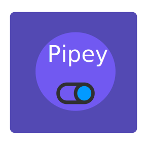
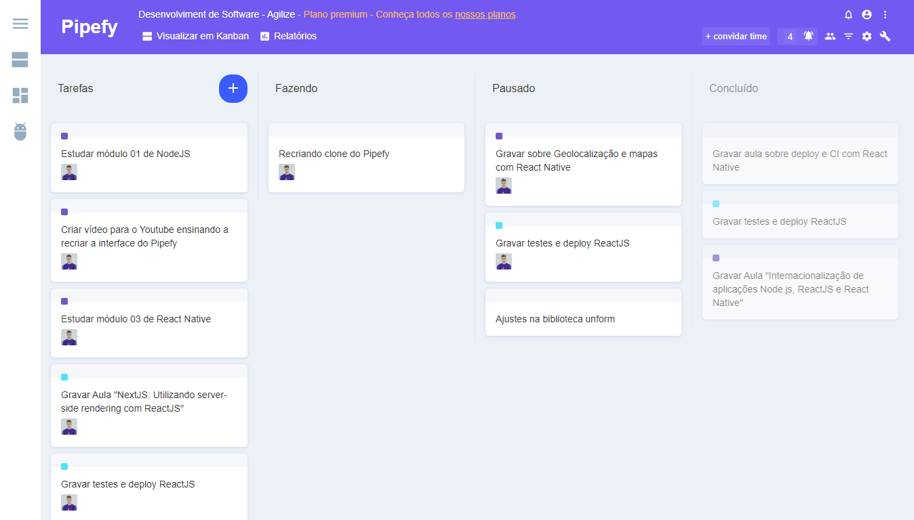

<div align="center">
    
</div>

<h1 align="center"> <strong> Projeto Clone Pipefy </strong> - by Rocketseat</h1>

<p align="center">
  <a aria-label="Versão do React" href="#">
    </img>
  </a>
  
  <a aria-label="Versão do Immer" href="#">
    </img>
  </a>

  <a aria-label="Versão do React DnD" href="#">
    </img>
  </a>

  <a aria-label="Versão do React dnd html5 backend" href="#">
    </img>
  </a>

  <a aria-label="Versão do React e Icons" href="#">
    </img>
  </a>
    
  <a aria-label="Rocketseat" href="#">
    </img>
  </a>

  <a aria-label="License" href="#">
    </img>
  </a>
</p>

<p align="center">
  <a href="#rocket-tecnologias">Tecnologias</a>&nbsp;&nbsp;&nbsp;|&nbsp;&nbsp;&nbsp;
  <a href="#-projeto">Projeto</a>&nbsp;&nbsp;&nbsp;|&nbsp;&nbsp;&nbsp;
  <a href="#memo-licença">Licença</a>
</p>

<br>

## :rocket: Tecnologias

As tecnologias utilizadas foram:

- [React](https://reactjs.org)
- [React DnD](https://react-dnd.github.io/react-dnd/)
- [React DnD HTML5 Backend](https://www.npmjs.com/package/react-dnd-html5-backend)
- [Immer](https://immerjs.github.io/immer/docs/introduction)
- [React Icons](https://react-icons.netlify.com/#/)

## 💻 Projeto

Este projeto visou replicar o pipefy.

### Instalação

##### Para Execução do Projeto
Acesse a pasta frontend com o seu terminal e em seguida execute:

```bash
yarn install
yarn start
```

Assim que o processo terminar, automaticamente será aberta uma página `localhost:3000` em seu navegador padrão, com o frontend sendo executado. 


##### Resultado da aplicação em execução:

<p align="center">
  
</p>

## :memo: Licença

Esse projeto está sob a licença MIT. Veja o arquivo [LICENSE](LICENSE.md) para mais detalhes.